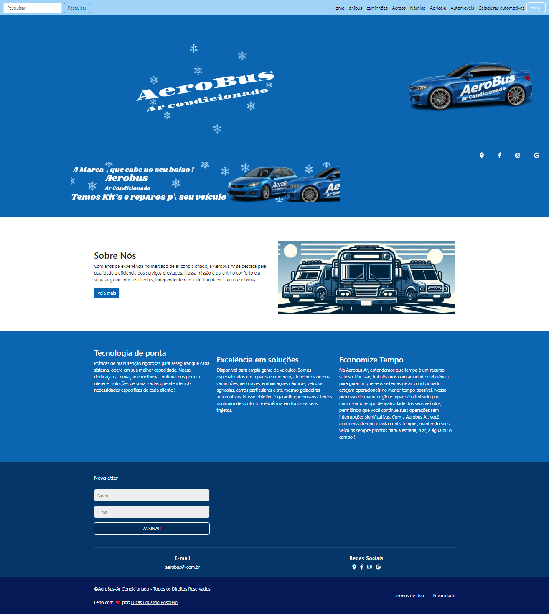

<h1 align="center"> AeroBus | Ar Condicionado</h1>

  
  

Desafio avaliativo da disciplina Desenvolvimento Web I do Curso de <a href="https://fatecararas.cps.sp.gov.br/tecnologia-em-desenvolvimento-de-softwares-multiplataforma/">DSM- Desenvolvimento de software multiplataforma.</a>

  

 

<h3 align="center">✅ Concluído ✅</h3>

 <a href="#-Projeto">Sobre o projeto</a> •
 <a href="#-tecnologias">Tecnologias</a> • 
 <a href="#-layout">Layout</a> • 
<a href="#-Deploy-do-projeto">Deploy</a> •
<a href="#Licença">Licença</a>

## 🚀 Tecnologias

Esse projeto foi desenvolvido com as seguintes tecnologias:

  <!--  -->
  
  
  
  

## 💻 Projeto

O Projeto é uma melhoria de um site de uma empresa real, no caso a AeroBus Ar Condicionado, que já existia, mas estava muito ruim, foi criado um novo layout, o layout foi pensado para a empresa real, mas é apenas um projeto Avaliativo de página única, as outras páginas foram criadas, mas não foi concluídas.

## 🔖 Layout

 

## Deploy do projeto

Confira [aqui.](https://aerobus.netlify.app)
---
## :memo: Licença

Esse projeto está sob a licença MIT.

---

 
Feito com ❤️ por: <a href="https://linktr.ee/lucas.007"> Lucas Eduardo Rosolem</a>

